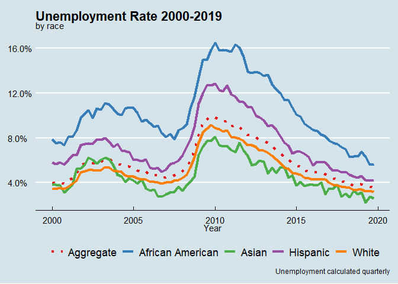

Unemployment Rates by Race
================

``` r
library(tidyverse)
library(lubridate)
library(directlabels)
library(ggthemes)
```

``` r
fredgraph <- read_csv(here::here("data", "fredgraph.csv"))
fredgraph <- fredgraph %>%
  mutate(DATE = ymd(DATE)) %>% 
  rename("Aggregate" = UNRATE,
         "African American" = LNS14000006,
         "Hispanic" = LNS14000009,
         "White" = LNS14000003,
         "Asian" = LNU04032183) %>% 
  pivot_longer(cols = 2:6, names_to = "group", values_to = "val") %>% 
  filter(year(DATE) != 2020) %>% 
  mutate(group = fct_relevel(group, "Aggregate", "African American", "Asian", "Hispanic", "White"))
```

``` r
fredgraph %>% 
  ggplot(aes(x = DATE, y = val, color = group, linetype = group))+
  geom_line(size = 1.5)+
  scale_color_manual(values = c("#e41a1c", "#377eb8", "#4daf4a", "#984ea3", "#ff7f00"))+
  scale_linetype_manual(values = c("dotted", "solid", "solid", "solid", "solid"))+
  theme_economist()+
  labs(title = "Unemployment Rate 2000-2019",
       subtitle = "by race",
       x = "Year",
       y = NULL,
       caption = "Unemployment calculated quarterly",
       color = NULL,
       linetype = NULL)+
  scale_y_continuous(labels = scales::label_percent(scale = 1))+
  theme(legend.position = "bottom")
```

<!-- -->

``` r
presidents <- list(
  annotate("rect", xmin = as.Date("2000-01-01"),
                   xmax = as.Date("2009-01-01"), 
                   ymin = 0, 
                   ymax = Inf, 
                   fill = "Red", 
                   alpha = .2),
  annotate("text", x = as.Date("2001-01-01"), 
                   y = 18, 
                   label = "Bush"),
  
  annotate("rect", xmin = as.Date("2009-01-01"),
                   xmax = as.Date("2017-01-01"),
                   ymin = 0, ymax = Inf, 
                   fill = "Blue", 
                   alpha = .2),
  annotate("text", x = as.Date("2010-01-01"),
                   y = 18, label = "Obama"),
  
  annotate("rect", xmin = as.Date("2017-01-01"), 
                   xmax = as.Date("2021-01-01"), 
                   ymin = 0, 
                   ymax = Inf,
                   fill = "Red", 
                   alpha = .2),
  annotate("text", x = as.Date("2018-01-01"), 
                   y = 18, label = "Trump")
)
```

``` r
fredgraph %>% 
  ggplot(aes(x = DATE, y = val, color = group, linetype = group))+
  geom_line(size = 1.5)+
  scale_color_manual(values = c("#e41a1c", "#377eb8", "#4daf4a", "#984ea3", "#ff7f00"))+
  scale_linetype_manual(values = c("dotted", "solid", "solid", "solid", "solid"))+
  theme_economist()+
  labs(title = "Unemployment Rate 2000-2019",
       subtitle = "by race",
       x = "Year",
       y = NULL,
       caption = "Unemployment calculated quarterly",
       color = NULL,
       linetype = NULL)+
  scale_y_continuous(labels = scales::label_percent(scale = 1))+
  theme(legend.position = "bottom")+
  presidents
```

<!-- -->
